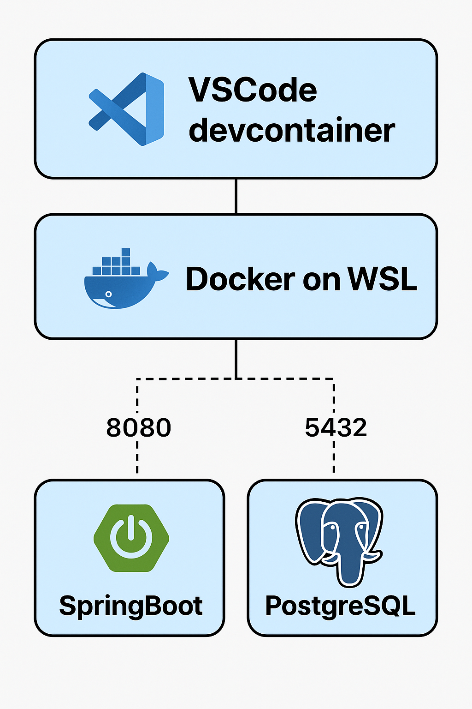

# Java PostgreSQL Skeleton

VSCodeのDev Containerを用いたSpring BootとPostgreSQLのコンテナ環境

## 概要

このプロジェクトは、Visual Studio CodeのDev Container機能を使用して、Spring BootアプリケーションとPostgreSQLデータベースを含む開発環境を提供します。



## 特徴

- **Spring Boot**: Javaベースのマイクロサービス開発フレームワーク
- **PostgreSQL**: オープンソースのリレーショナルデータベース
- **Dev Container**: VSCodeで一貫した開発環境を提供
- **Docker Compose**: 複数のコンテナを管理

## 必要な環境

- Windows 11 + WSL2
- Visual Studio Code
- Docker
- Docker Compose
- Dev Containers拡張機能

## セットアップ手順

[SETUP.md](SETUP.md)を参照

## 開発環境の構成

### Spring Bootアプリケーション
- OpenJDK 21
- Maven
- Spring Boot 3.x
- Spring Data JPA
- Spring Boot Starter Thymeleaf
- Spring Boot Starter Validation

### PostgreSQLデータベース
- PostgreSQL 15
- デフォルトデータベース: `app_db`
- ユーザー: `postgres`
- パスワード: `password`

### pgAdmin (データベース管理ツール)
- pgAdmin 4 Web Interface
- アクセス: `http://localhost:5050`
- ログイン情報:
  - Email: `admin@example.com`
  - パスワード: `admin`
- PostgreSQL接続情報:
  - ホスト名: `db`
  - ポート: `5432`
  - データベース: `app_db`
  - ユーザー名: `postgres`
  - パスワード: `password`

## 使用方法

### アプリケーションの起動

#### 1. 通常モード
```bash
./mvnw spring-boot:run
```

#### 2. VSCodeデバッガーを使用したデバッグ
1. VSCodeの「実行とデバッグ」タブ（Ctrl+Shift+D）を開く
2. 以下の設定から選択して実行：
   - **JavaPostgresqlSkeletonApplication**: 通常モード
   - **JavaPostgresqlSkeletonApplication (Dev Mode)**: 開発モード
   - **JavaPostgresqlSkeletonApplication (Debug Mode)**: フルデバッグモード

#### 3. コマンドラインでのデバッグモード
```bash
# 開発プロファイルで起動
./mvnw spring-boot:run -Dspring.profiles.active=dev

# デバッグプロファイルで起動（詳細ログ有り）
./mvnw spring-boot:run -Dspring.profiles.active=debug

# JVMデバッガー接続可能で起動
./mvnw spring-boot:run -Dagentlib:jdwp=transport=dt_socket,server=y,suspend=n,address=5005
```

#### 4. プロファイル別の特徴

**デフォルト（本番想定）:**
- 最小限のログ出力
- パフォーマンス重視の設定

**Dev Mode（開発用）:**
- アプリケーションログをDEBUGレベルで出力
- SQLログを適度に表示
- テーブル構造の自動更新

**Debug Mode（デバッグ用）:**
- 全ての詳細ログを出力（SQL、Hibernate、Spring Web等）
- テーブルを毎回再作成
- Spring Boot Actuatorエンドポイント有効化
- エラー時のスタックトレース表示

### デバッグ用エンドポイント（Debug Modeのみ）

Debug Modeで起動時に以下のエンドポイントが利用可能：

- `http://localhost:8080/actuator/health` - アプリケーションヘルス情報
- `http://localhost:8080/actuator/env` - 環境変数とプロパティ情報
- `http://localhost:8080/actuator/loggers` - ログレベルの確認・変更
- `http://localhost:8080/actuator/mappings` - URLマッピング情報
- `http://localhost:8080/actuator/beans` - Spring Beanの情報

### データベース接続

アプリケーション内でのPostgreSQLへの接続設定は `application.yml` または `application.properties` で確認できます。  
テーブル構成は[DATABASE.md](DATABASE.md)を参照

### Thymeleafテンプレートエンジン

#### テンプレートファイルの配置
- テンプレートファイル: `src/main/resources/templates/`
- 静的リソース: `src/main/resources/static/`
- ファイル形式: `.html`

#### 基本的な使い方
```html
<!DOCTYPE html>
<html xmlns:th="http://www.thymeleaf.org">
<head>
    <title th:text="${title}">Default Title</title>
</head>
<body>
    <h1 th:text="${message}">Default Message</h1>
    <ul>
        <li th:each="user : ${users}" th:text="${user.username}">Default Username</li>
    </ul>
</body>
</html>
```

#### Thymeleaf設定（application.yml）
- キャッシュ無効化（開発時）
- UTF-8エンコーディング
- HTMLモード設定
- テンプレート接頭辞・接尾辞設定

#### アクセス方法
- **Webページ**: `http://localhost:8080/` - Thymeleafテンプレートでユーザー一覧表示

### テストの実行

```bash
./mvnw test
```

## ポート設定

- Spring Boot アプリケーション: `http://localhost:8080`
- PostgreSQL: `localhost:5432`
- pgAdmin (データベース管理): `http://localhost:5050`

## 開発のヒント

- WSL2上のDockerでコンテナが実行されるため、パフォーマンスが最適化されています
- Dev Container内では、すべての依存関係が自動的にインストールされます
- PostgreSQLは別コンテナで実行され、アプリケーションコンテナから接続可能です
- pgAdminでデータベースをGUIで管理・操作可能です
- VSCodeの拡張機能やデバッグ設定も自動的に設定されます
- WSL2のファイルシステム（`/home/`）にプロジェクトを配置することでパフォーマンスが向上します

## トラブルシューティング

### コンテナが起動しない場合
1. WSL2が有効になっていることを確認
2. Docker DesktopでWSL2統合が有効になっていることを確認
3. Docker Desktopが起動していることを確認
4. Dev Containers拡張機能がインストールされていることを確認
5. `.devcontainer/devcontainer.json` の設定を確認

### データベース接続エラーの場合
1. PostgreSQLコンテナが起動していることを確認
2. 接続設定（ホスト名、ポート、認証情報）を確認

### WSL2関連の問題
1. `wsl --list --verbose` でWSL2が実行されていることを確認
2. Docker DesktopのSettings > Resources > WSL Integrationで統合が有効になっていることを確認

## ライセンス

MIT License